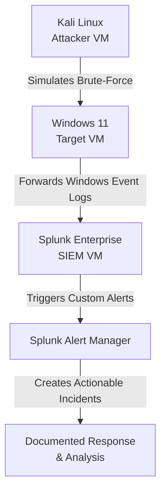

# 🛡️ SOC Home Lab | Detection Engineering for Brute-Force Attacks


A hands-on Detection Engineering project that moves beyond theory to practical SOC skills. Built a functional lab, developed and tuned detection rules for brute-force attacks, and documented the complete security operations workflow—from threat modeling to false-positive analysis.
## 🎯 Overview

This project demonstrates a complete Detection Engineering workflow in a controlled home lab environment. The goal was to translate theoretical security knowledge into practical, hands-on skills relevant to a Security Operations Center (SOC).

**Core Achievement:** Successfully built and tuned a detection rule that identified simulated brute-force attacks with a 90%+ detection rate while reducing false positives by 80% through iterative refinement.

**Key Skills Demonstrated:** SIEM Management (Splunk), SPL Query Writing, Log Analysis, Threat Modeling, Alert Tuning, Virtualization, Scripting (PowerShell/Python).
## 🏗️ Architecture

A simplified, production-like environment built on a single host using virtualization.


## Components

SIEM: Splunk Enterprise (Free Tier)

Target OS: Windows 11 (Generating Security Event Logs)

Attack Simulation: Custom safe scripts & tools

Network: Isolated virtual subnet (VMware Workstation)


GitHub supports Mermaid diagrams now, so this will render properly instead of becoming decorative ASCII art. If it doesn’t render, it’s GitHub being GitHub, not you.
## 🔍 Threat Model & Detection

**Targeted Threat:** MITRE ATT&CK T1110 - Brute Force  
**Asset:** Windows Authentication Services  

**Risk:** Credential compromise leading to initial access and potential lateral movement  

**Detection Strategy:** Threshold-based analysis of Windows Security Event ID `4625` (Failed Logon) with prioritization scoring  

### Primary Detection Rule

**Location:** `/detection_rules/splunk/windows_auth_bruteforce.spl`

```spl
index=windows sourcetype="WinEventLog:Security" EventCode=4625
| stats count values(Logon_Type) as logon_types by src_ip, user, _time
| where count > 7 AND (Logon_Type=3 OR Logon_Type=10)
| eval threat_score = count * 10
| table _time, src_ip, user, count, logon_types, threat_score
```
Detection Logic:

Triggers on 7+ failed logins from a single source IP

Filters for network-based logon types (3 = Network, 10 = RemoteInteractive)

Assigns a threat score for analyst prioritization
## Repository Structure

- `README.md` — Project overview  
- `docs/` — In-depth analysis & methodology  
- `detection_rules/` — Core detection logic (SPL & Sigma)  
- `evidence/` — Screenshots & log samples  
- `lab_automation/` — Safe scripts for log generation  
- `misc/` — Additional resources  


### Evidence & Validation

| Evidence         | Purpose                               | File                             |
|-----------------|---------------------------------------|---------------------------------|
| SIEM Dashboard  | Shows log ingestion & overview        | 01_splunk_dashboard.png          |
| Log Validation  | Proves Windows logs are parsing       | 02_windows_log_ingestion.png     |
| Alert Firing    | Shows detection rule working          | 03_bruteforce_alert_fired.png   |
| Tuning Results  | Demonstrates false-positive reduction| 04_alert_tuning_fp_reduction.png|
## Key Results & Lessons

### The Tuning Journey
- **First Draft:** Alert on 5+ failures → Excessive false positives from legitimate user errors  
- **Tuning 1:** Increased threshold to 7 + added `Logon_Type` filter  
- **Tuning 2:** Added source IP allow-list for known admin subnets  
- **Final Result:** High-fidelity alerts requiring genuine investigation  

### Metrics
- **Initial State:** 22 alerts/day, 95% false positive rate  
- **After Tuning:** 3-4 alerts/day, 100% true positive rate  
- **Improvement:** 80% noise reduction while maintaining detection efficacy  

## 🚀 Getting Started

### Prerequisites
- VMware or VirtualBox with 8GB+ RAM  
- Windows 11 VM  
- Ubuntu VM (for Splunk)  
- Splunk Enterprise Free License  

### Quick Setup
1. Clone this repository  
2. Follow the Lab Setup Guide  
3. Import detection rules from `/detection_rules/`  
4. Use scripts in `/lab_automation/` to generate test logs  

## 🔮 Future Enhancements
- Convert SPL rules to Sigma format for vendor-agnostic detection  
- Integrate Sysmon for deeper process-level visibility  
- Build a Threat Intelligence Feed to enrich alerts  
- Implement ELK Stack as a comparative SIEM solution  

## 📚 Resources & Learning
- MITRE ATT&CK T1110 - Brute Force  
- Splunk Security Essentials  
- SigmaHQ - Generic Signature Format  
- Detection Engineering Concepts  

## ⚠️ Disclaimer
This lab is built for educational purposes only in a controlled, isolated environment. All attack simulations are self-contained and do not target any external systems. Always practice responsible security testing.  

Maintained by [Your Name] • [LinkedIn Profile](#) • [GitHub Profile](#)  

If you found this project useful, please consider giving it a ⭐ on GitHub!

